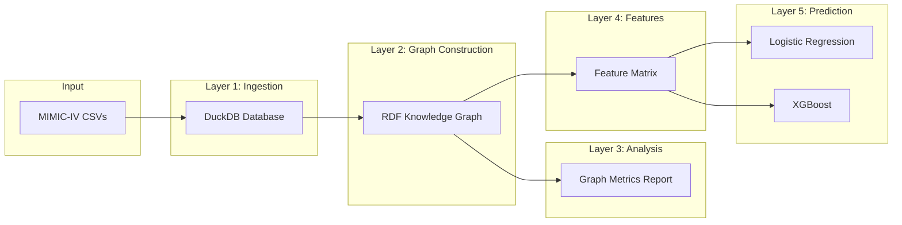
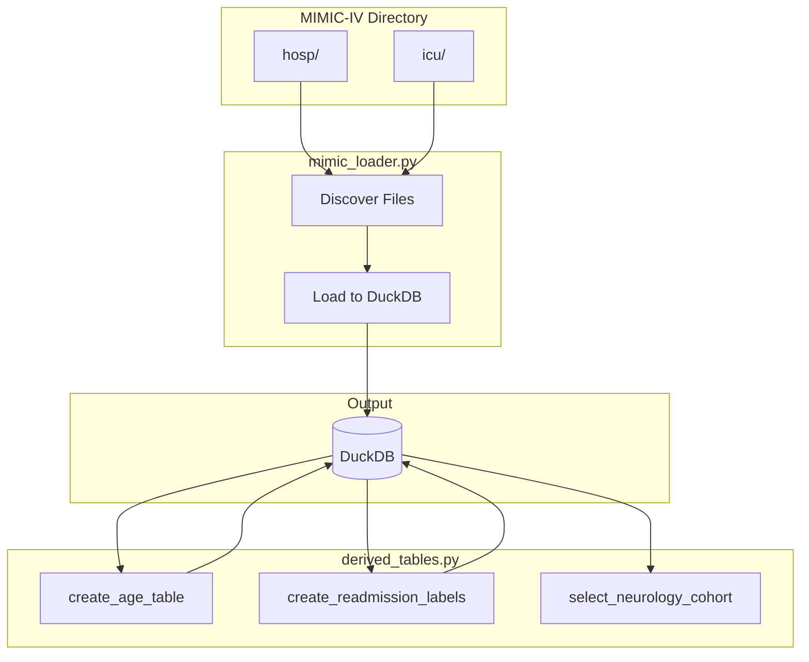
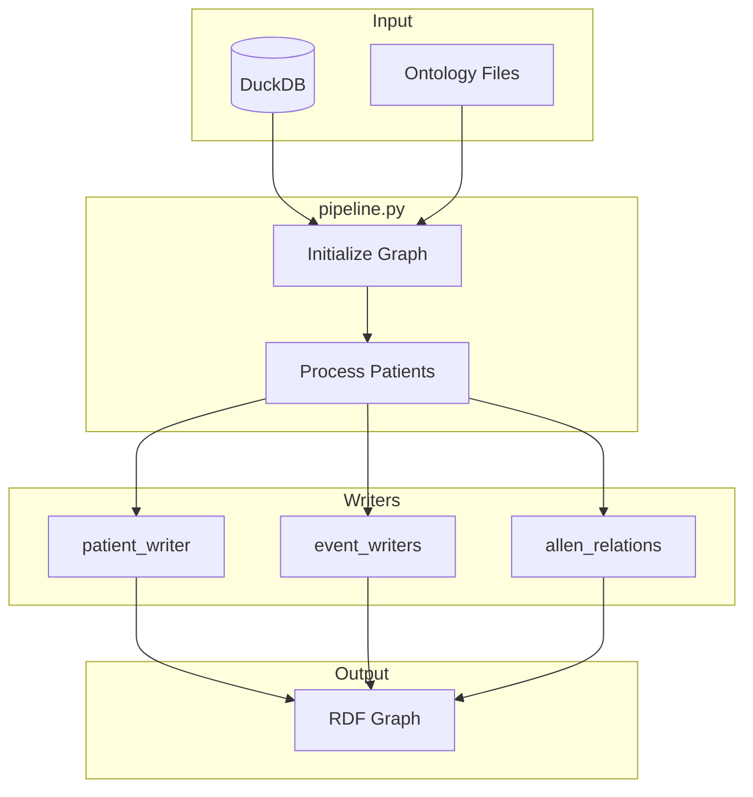
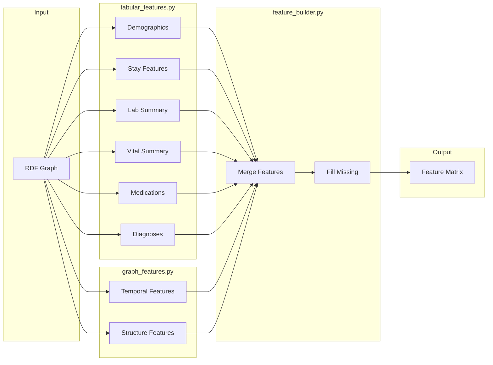
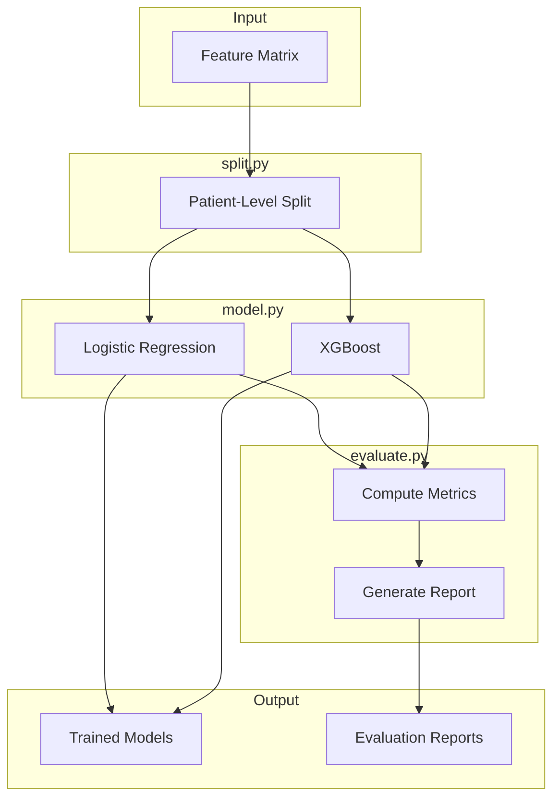
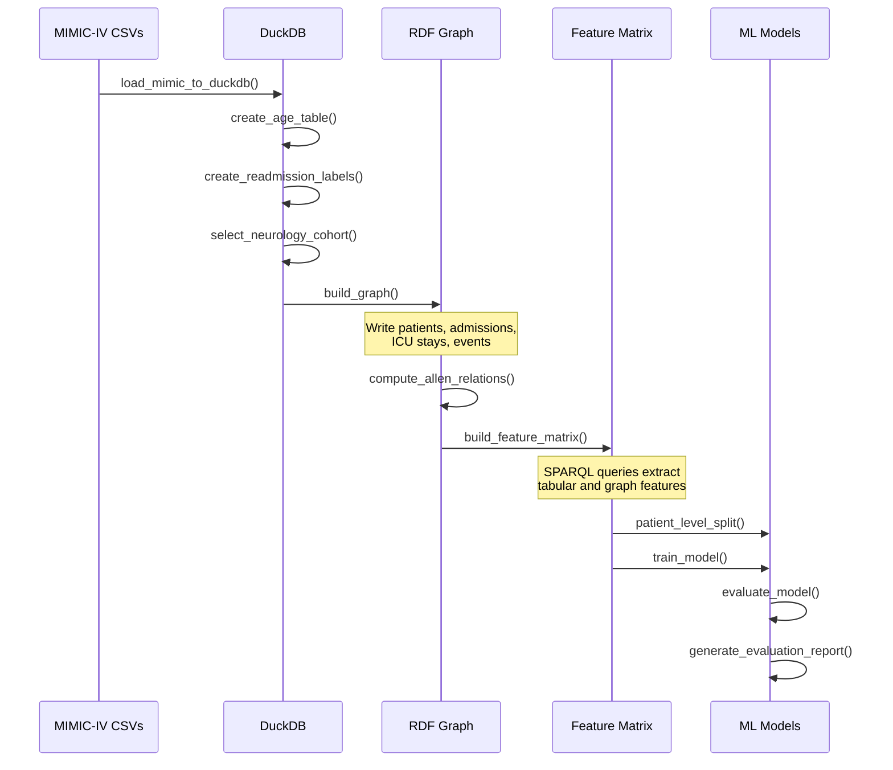
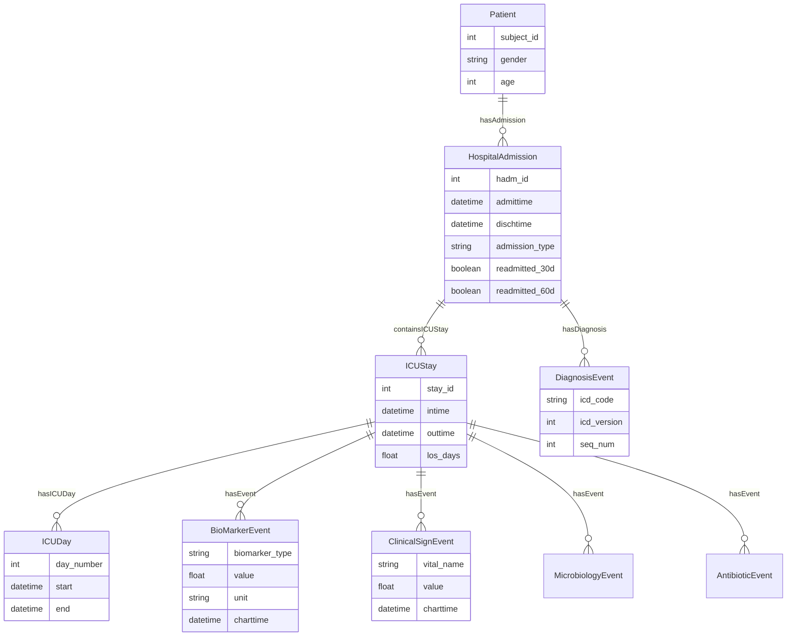
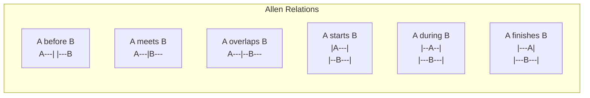
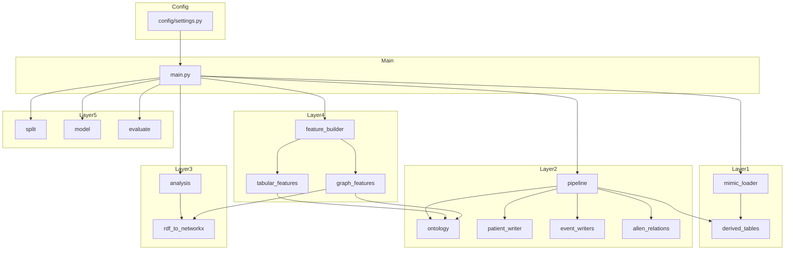

# Architecture

This document describes the architecture of the Temporal Knowledge Graph-Based Hospital Readmission Prediction system.

## Research Foundation

This implementation is based on the conceptual modeling approach for temporal knowledge graphs presented by Vannieuwenhuyze, Mimouni, and Du Mouza in ["A Conceptual Model for Discovering Implicit Temporal Knowledge in Clinical Data"](https://doi.org/10.1007/978-3-032-08620-4_6) (ER 2025). The original implementation is available at [github.com/avannieuwenhuyze/clinical-tkg-cmls2025](https://github.com/avannieuwenhuyze/clinical-tkg-cmls2025).

## System Overview

The system is organized as a 5-layer pipeline that transforms raw MIMIC-IV data into trained machine learning models for predicting 30-day hospital readmission.

## Layer Details

### Layer 1: Data Ingestion

**Purpose**: Load MIMIC-IV data into DuckDB for efficient SQL querying. Supports two data sources:
- **Local CSVs** (`DATA_SOURCE=local`): Auto-discovers and loads all CSV/CSV.GZ files from `hosp/` and `icu/` directories
- **Google BigQuery** (`DATA_SOURCE=bigquery`): Pulls data directly from `physionet-data.mimiciv_hosp` / `physionet-data.mimiciv_icu` using two-phase loading — small/dimension tables are loaded in full, then large tables (labevents, chartevents, microbiologyevents, prescriptions) are filtered by cohort subject IDs to minimize data transfer

**Modules**:
- `src/ingestion/__init__.py` - Dispatch function `load_mimic_data()` routes to the appropriate loader
- `src/ingestion/mimic_loader.py` - Local CSV → DuckDB loader
- `src/ingestion/bigquery_loader.py` - BigQuery → DuckDB loader (two-phase with cohort filtering)
- `src/ingestion/derived_tables.py` - Creates age, readmission labels, and cohort selection tables

**Input**: MIMIC-IV directory (local) or BigQuery project (cloud)
**Output**: `data/processed/mimiciv.duckdb`

**Key Tables Loaded** (31 total):
- `patients`, `admissions`, `icustays` - Core patient data
- `diagnoses_icd`, `d_icd_diagnoses` - Diagnosis codes
- `labevents`, `d_labitems` - Lab results
- `chartevents`, `d_items` - Vital signs and observations
- `prescriptions` - Medications
- `microbiologyevents` - Culture results

**Derived Tables**:
- `age` - Age at admission (computed from anchor values)
- `readmission_labels` - 30/60-day readmission flags

### Layer 2: Graph Construction

**Purpose**: Build an OWL-Time compliant RDF knowledge graph from the relational data.

**Modules**:
- `src/graph_construction/pipeline.py` - Orchestrates the graph build process
- `src/graph_construction/ontology.py` - Initializes namespaces and loads base ontologies
- `src/graph_construction/patient_writer.py` - Creates Patient and HospitalAdmission nodes
- `src/graph_construction/event_writers.py` - Creates clinical event nodes
- `src/graph_construction/temporal/allen_relations.py` - Computes Allen interval relations

**Input**: DuckDB database + ontology files
**Output**: `data/processed/knowledge_graph.rdf`

### Layer 3: Graph Analysis

**Purpose**: Generate statistics and structure analysis of the knowledge graph.

**Modules**:
- `src/graph_analysis/analysis.py` - SPARQL queries for graph metrics
- `src/graph_analysis/rdf_to_networkx.py` - Converts RDF to NetworkX for algorithms

**Input**: RDF knowledge graph
**Output**: `outputs/reports/graph_analysis.md`

### Layer 4: Feature Extraction

**Purpose**: Extract ML-ready features from the knowledge graph using SPARQL queries.

**Modules**:
- `src/feature_extraction/tabular_features.py` - Demographics, labs, vitals, medications, diagnoses
- `src/feature_extraction/graph_features.py` - Temporal relations, graph structure metrics
- `src/feature_extraction/feature_builder.py` - Combines all features into single matrix

**Input**: RDF knowledge graph
**Output**: `data/features/feature_matrix.parquet`

### Layer 5: Prediction

**Purpose**: Train and evaluate classification models.

**Modules**:
- `src/prediction/split.py` - Patient-level train/val/test splitting
- `src/prediction/model.py` - Model training (LR, XGBoost)
- `src/prediction/evaluate.py` - Metrics computation and report generation

**Input**: Feature matrix
**Output**: Models and evaluation reports

## Data Flow

## Entity-Relationship Diagram

The RDF graph models clinical data using OWL-Time temporal ontology:

## Temporal Modeling

Events are modeled as OWL-Time intervals or instants with Allen temporal relations:

Each relation is represented using OWL-Time predicates:
- `time:before` - A ends before B starts
- `time:intervalMeets` - A ends exactly when B starts
- `time:intervalOverlaps` - A starts before B, A ends during B
- `time:intervalStarts` - Same start, A ends first
- `time:inside` (during) - A entirely within B
- `time:intervalFinishes` - Same end, A starts later

## Module Dependencies

## Performance Considerations

### Memory Usage

| Stage | Memory Pattern | Optimization |
|-------|---------------|--------------|
| Ingestion | Streaming | DuckDB handles large files |
| Graph Build | Linear in patients | Process one patient at a time |
| Allen Relations | O(n²) per ICU stay | Use `--skip-allen` flag |
| Feature Extraction | SPARQL queries | Batched by admission |
| Model Training | Full matrix in memory | Sparse representation |

### Processing Time

Approximate times for 1000 patients (16GB RAM machine):

| Stage | Time |
|-------|------|
| Ingestion (first run) | 5-10 min |
| Graph Construction | 2-5 min |
| Allen Relations | 10-30 min |
| Feature Extraction | 1-2 min |
| Model Training | < 1 min |

Use `--skip-allen` to reduce graph construction time by 80%+.

### Parallelization

Current implementation is single-threaded. Potential parallelization points:
- Patient processing in graph construction
- SPARQL queries in feature extraction
- Cross-validation folds in model training
