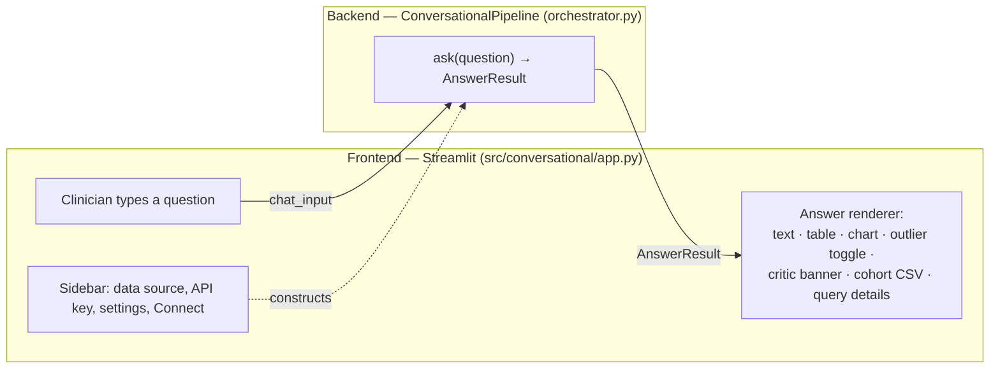
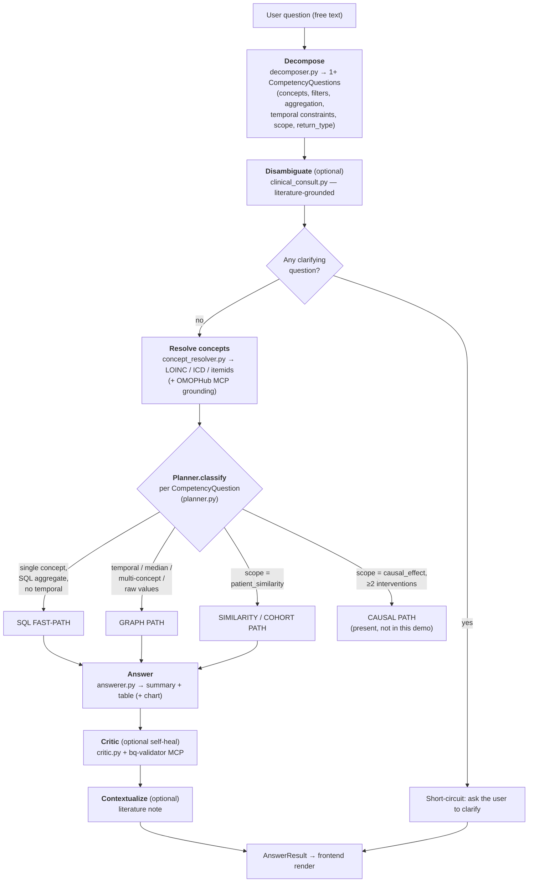
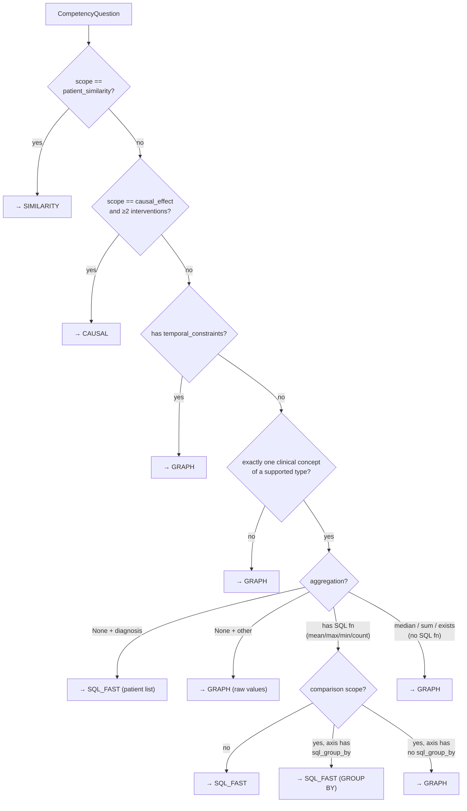
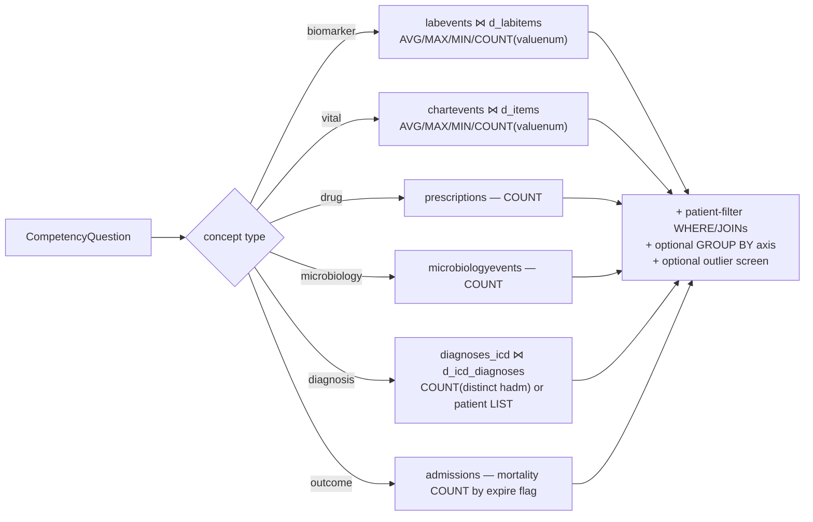
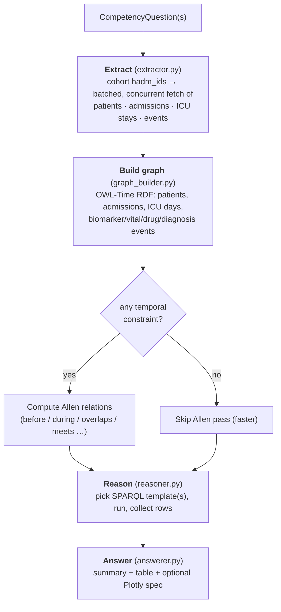
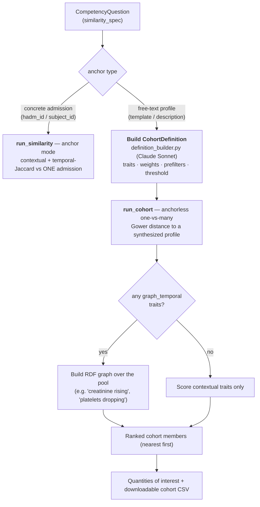
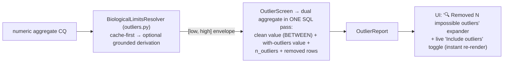
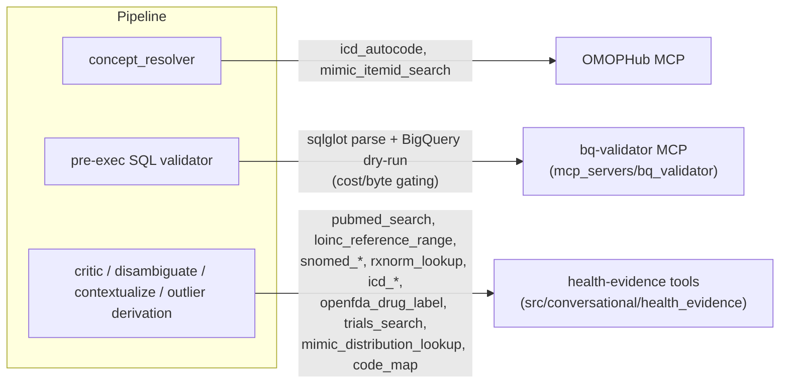

# NeuroGraph — How the Chatbot Works (Architecture & Query Lifecycle)

> **Purpose.** A demo-day quick reference and a faithful map of how a typed
> clinical question becomes an answer. Written for the UChicago demonstration:
> it traces the path a query takes from the chat box, through every coding
> module and MCP, down the **SQL fast-path** vs. the **knowledge-graph path**
> (and the **patient-similarity / cohort** path), through outlier
> detection/removal, all the way to the rendered answer. Findings and honest
> caveats are collected at the end (§9).

The system is branded **NeuroGraph** in the UI. Today it is wired to **MIMIC-IV**
(via BigQuery or a local DuckDB copy); the architecture is the prototype for the
UChicago Medicine EHR product.

---

## 1. The two halves at a glance

- **Frontend** (`src/conversational/app.py`): a Streamlit chat UI. The sidebar
  picks the data source (Local DuckDB / BigQuery), takes the Anthropic API key,
  exposes performance knobs, and builds a `ConversationalPipeline`. The main
  pane is a scrolling transcript; each answer is rendered by `_render_answer`.
- **Backend** (`src/conversational/orchestrator.py`): `ConversationalPipeline.ask()`
  is the single entry point. It chains decomposition → planning → execution →
  review → answer, and returns one `AnswerResult` the frontend knows how to draw.

---

## 2. The end-to-end query lifecycle

Every turn flows through these stages. Stages in **bold** can call the Anthropic
API (Claude) or an MCP tool; the rest are deterministic Python/SQL.

**Multi-part questions.** The decomposer can return several CompetencyQuestions
("big questions"). Each is planned and executed independently; graph-path
sub-questions share one graph for the turn; results are stitched under one
narrative with a per-part breakdown (`AnswerResult.sub_answers`).

**Live progress.** `ask()` accepts a `progress_callback`; the UI shows the live
stage ("Interpreting your question…", "Running the query…", "Building the
knowledge graph…", "Scoring the candidate cohort…", "Reviewing the result…")
inside a `st.status` widget so a long cohort scoring read as *working*, not hung.

---

## 3. The routing decision — Fast-Path vs. Graph vs. Similarity

This is the most important branch for the demo. The **planner**
(`src/conversational/planner.py`, `QueryPlanner.classify`) decides **once per
CompetencyQuestion**, purely from its structure — no extra LLM call.

**Plain-language rule of thumb (use this on stage):**

| If the question… | Path | Why |
|---|---|---|
| asks for one **metric** (avg/max/min/count) of **one** thing, with **no time element** | **SQL fast-path** | a single SQL aggregate answers it; the graph adds no value |
| **compares** that metric across sex / readmission / admission type / discharge location | **SQL fast-path** | one `GROUP BY` query |
| involves **time** ("during the ICU stay", "first 48 hours", "before intubation") | **Graph path** | temporal (Allen) relations live in the graph |
| asks for a **median**, **raw values to plot**, or **several concepts at once** | **Graph path** | needs per-value retrieval / Python post-processing / multi-event joins |
| asks to **find patients similar to** a described profile | **Similarity / cohort path** | one-vs-many distance scoring |

**The defining fact for the demo:** *the SQL fast-path runs when neither the
question nor the requested answer contains temporal data; a temporal element on
either side sends the query to the graph path.*

The vocabulary the planner recognizes is a single registry
(`operations.py` + `operations_filters/_aggregates/_comparison.py`):

- **Aggregations with a SQL function (fast-path):** `mean`/`avg`→`AVG`,
  `max`→`MAX`, `min`→`MIN`, `count`→`COUNT`.
  **Graph-only:** `median` (Python post-processing), `sum`, `exists`.
- **Comparison axes (fast-path GROUP BY):** `gender`, `age`, `admission_type`,
  `discharge_location`, `readmitted_30d`, `readmitted_60d`.
- **Patient filters:** `age`, `gender`, `diagnosis` (ICD/title), `admission_type`,
  `subject_id`, `readmitted_30d`, `readmitted_60d`.
- **Fast-path concept types:** `biomarker`, `vital`, `drug`, `microbiology`,
  `diagnosis`, `outcome`.

---

## 4. The SQL fast-path (`sql_fastpath.py`)

For a fast-path CQ, `compile_sql` emits **one** SQL statement (DuckDB *or*
BigQuery dialect, via a duck-typed backend) — skipping extraction, the graph,
and SPARQL entirely. That is why these answers are near-instant.

- **Grounding to avoid unit pollution.** A biomarker that resolves to a LOINC
  code is filtered by `itemid IN (...)` (precise) rather than
  `label LIKE '%creatinine%'` (which would pool serum + urine + 24-hr variants).
  Diagnoses ground to ICD code IN-lists via OMOPHub, OR-ed with a title-LIKE
  fallback so ICD-9 admissions still match.
- **Comparisons** add `… AS group_value, AVG(...) AS avg_value, COUNT(...)` and a
  `GROUP BY` on the axis's `sql_group_by` column.
- A **defensive re-check** raises if a CQ with temporal constraints or multiple
  concepts ever reaches the compiler — misrouting fails loudly, never silently.

---

## 5. The knowledge-graph path (the "non-fast" path)

When the planner picks `GRAPH`, the backend builds a **per-question RDF knowledge
graph** with temporal structure, then answers via SPARQL.

What the graph path can do that the fast-path **cannot**:

- **Median** (and other Python post-processed aggregates) — raw values are
  pulled, then `statistics.median` is applied.
- **Raw time-series with timestamps** — `(value, unit, timestamp)` rows, the
  substrate for trend/line charts.
- **Allen temporal relations** — "creatinine *before* intubation", "antibiotics
  *during* the first 48h", "values *within* 24h of ICU admission".
- **Multi-concept** questions — several biomarkers/events in one answer.

**Performance note (matters for the demo):** the graph is built over the whole
matching cohort. A broad cohort ("patients over 65") means a large, slow build;
the Allen pass is `O(n²)` within a stay. **Narrow the cohort** (a diagnosis, a
specific window) to keep graph turns fast — see the runbook.

---

## 6. The patient-similarity / cohort path (`src/similarity/`)

`scope == "patient_similarity"` routes here. There are two modes; the demo uses
the second.

- **Contextual similarity** (`contextual.py`): a 5-group, Gower-style score —
  demographics, comorbidity burden, comorbidity set, severity, social.
- **Temporal similarity** (`temporal.py`): decay-weighted Jaccard over
  time-bucketed event sets — only when a concrete admission anchor exists. A
  free-text *template* has no trajectory, so scoring falls back to
  contextual-only.
- **Cohort output**: a ranked table (`rank, hadm_id, subject_id, distance`),
  cohort-level quantities of interest (distance distribution + per-trait means),
  and a **CSV download** — the take-away artifact. Database keys (`hadm_id`,
  `subject_id`) appear only in the table/CSV, never in the chat prose a clinician
  must read or type.

---

## 7. Cross-cutting machinery

### 7.1 Outlier detection & removal (biological-impossibility screening)

Numeric biomarker/vital aggregates are screened **before** aggregation for
*physiologically impossible* values (data-entry errors), not merely high ones.

- Bounds are **deliberately wider** than normal reference ranges: a sepsis
  lactate of 12 mmol/L is high-but-real (kept); a lactate of 1,000,000 is
  impossible (removed). Source: a literature-seeded cache
  (`data/ontology_cache/biological_limits.json`) with an EvidenceAgent
  derivation fallback on a cache miss.
- The clean answer is the default; the **toggle** flips to the precomputed
  with-outliers value with no re-query and no second LLM call. Charts always use
  the clean data (a plot dominated by a 1e6 typo is useless).
- If no bound can be resolved, the query simply runs **unscreened** — the system
  never invents a bound or false-removes.

### 7.2 The plausibility critic & self-healing

After an answer is generated, an optional **critic** (`critic.py`, a Claude
tool-use loop) sanity-checks it against external evidence (PubMed, LOINC
reference ranges, the MIMIC distribution). Verdicts are `info` (silent) / `warn`
(yellow banner) / `block` (red banner). If the critic catches a biomarker
LOINC-grounding error and proposes a better code, the orchestrator **re-runs the
fast-path once** with the correction and shows a "🔄 Self-healed answer" trace.

### 7.3 MCP servers & tools

- **bq-validator** (local stdio MCP, `mcp_servers/bq_validator/server.py`):
  parses fast-path SQL with `sqlglot` and **dry-runs** it against BigQuery to
  block confidently-broken or too-expensive queries *before* paying for them.
  Only active on the BigQuery data source.
- **OMOPHub** grounding inside `concept_resolver`: turns "sepsis" → ICD-10
  code lists, lab names → MIMIC `itemid`s. Falls back to LIKE cleanly when no
  API key is set.
- **health-evidence tools**: the external sources the critic, disambiguator,
  contextualizer, and outlier-derivation agent consult — PubMed, LOINC, SNOMED,
  RxNorm, ICD, openFDA, ClinicalTrials, and MIMIC distributions. Each cited
  source the critic relied on is surfaced under a "📚 Sources cited by reviewer"
  expander. A separate **PubMed MCP** is available to the broader environment.

---

## 8. Output types (what the renderer can show)

`_render_answer` in `app.py` understands every field of `AnswerResult`:

| Output | When | Rendered as |
|---|---|---|
| **Interpretation summary** | always | a blue "Interpreting as:" info block (verify before reading) |
| **Text summary** | always | markdown prose |
| **Data table** | results exist | a dataframe (clean, human-readable columns) |
| **Visualization** | `return_type == visualization` | a Plotly chart — scatter / line / bar / histogram / box |
| **Outlier panel** | impossible values removed | "🔍 Removed N outliers" expander + include/exclude toggle |
| **Critic banner** | critic ran | green (info) / yellow (warn) / red (block) + cited sources |
| **Self-heal trace** | a retry happened | "🔄 Self-healed answer" expander with each attempt |
| **Cohort CSV** | cohort path | "⬇ Download cohort (CSV)" button |
| **Multi-part breakdown** | big question | per-sub-question expanders under one narrative |
| **Clarifying question** | ambiguity | a bold follow-up prompt instead of an answer |
| **Query details** | always (when present) | expander with graph stats + the SQL/SPARQL that ran |

---

## 9. Findings & honest caveats (read before demoing)

1. **Routing is structural and deterministic.** Whether a question is fast-path
   or graph depends only on the decomposed CompetencyQuestion (concept count,
   aggregation, temporal constraints, scope) — verified for the whole demo
   script by `tests/test_demo/test_demo_routing.py`. The same harness compiles
   and executes every fast-path question against a MIMIC-shaped schema
   (`test_demo_sql_fastpath.py`).
2. **The richest visualizations are time-series, which use the graph path.**
   There is no SQL-fast-path line chart; "plot X over the ICU stay" builds a
   graph. A non-temporal histogram of raw cohort values is *also* graph-path
   (raw-value retrieval). Grouped comparison bar charts are the one fast-path
   visualization shape. Frame visualization as an *output type*, not a separate
   engine.
3. **Graph turns scale with cohort size.** Keep graph/temporal and visualization
   questions on a **narrow** cohort (a diagnosis, a specific window) so the build
   and the Allen pass stay fast. This is the single biggest live-demo risk.
4. **Patient-similarity uses clinical descriptions, never internal IDs.** The
   demo drives similarity from a described profile ("a 68-year-old woman with
   atrial fibrillation and CKD") → an anchorless cohort. Anchoring to a specific
   admission exists in code but requires typing an internal `hadm_id`, which is
   not how a clinician works, so the demo avoids it.
5. **Follow-up questions re-decompose with conversation context.** The system
   keeps the last ~10 turns and feeds them to the decomposer, so "now show their
   average creatinine" is interpreted against the prior cohort *description*. It
   does **not** automatically thread the exact returned `hadm_id` list into the
   next query — the cohort **CSV** is the precise, reproducible take-away.
6. **A causal-inference path exists but is out of scope for this demo.** Scope
   `causal_effect` routes to formal estimators (T/S/X-learner). It is documented
   in `docs/phase-8d-9-demo-guide.md`; this demo deliberately stays on the
   fast-path / graph / similarity surfaces.
7. **Failures are surfaced, not swallowed.** `ask()` catches pipeline exceptions
   and returns an error `AnswerResult` the UI renders as a red "Analysis failed"
   state (rather than a stack trace or a green "complete"). Guard-rail refusals
   (e.g., out-of-scope causal questions) are loud and explained.

---

### File map (where each stage lives)

| Stage | Module |
|---|---|
| Frontend / rendering | `src/conversational/app.py` |
| Welcome / example prompts | `src/conversational/demo_examples.py` |
| Orchestration | `src/conversational/orchestrator.py` |
| Decompose | `src/conversational/decomposer.py`, `prompts.py` |
| Disambiguate / clarify / contextualize | `src/conversational/clinical_consult.py` |
| Concept resolution (+ OMOPHub) | `src/conversational/concept_resolver.py` |
| Planner (routing) | `src/conversational/planner.py` |
| Operation registry | `src/conversational/operations*.py` |
| SQL fast-path | `src/conversational/sql_fastpath.py`, `sql_validator*.py` |
| Extract → graph → reason → answer | `extractor.py`, `graph_builder.py`, `reasoner.py`, `answerer.py` |
| Outlier screening | `src/conversational/outliers.py` |
| Critic + evidence tools | `critic.py`, `health_evidence/` |
| Similarity / cohort | `src/similarity/` |
| bq-validator MCP | `mcp_servers/bq_validator/server.py` |
