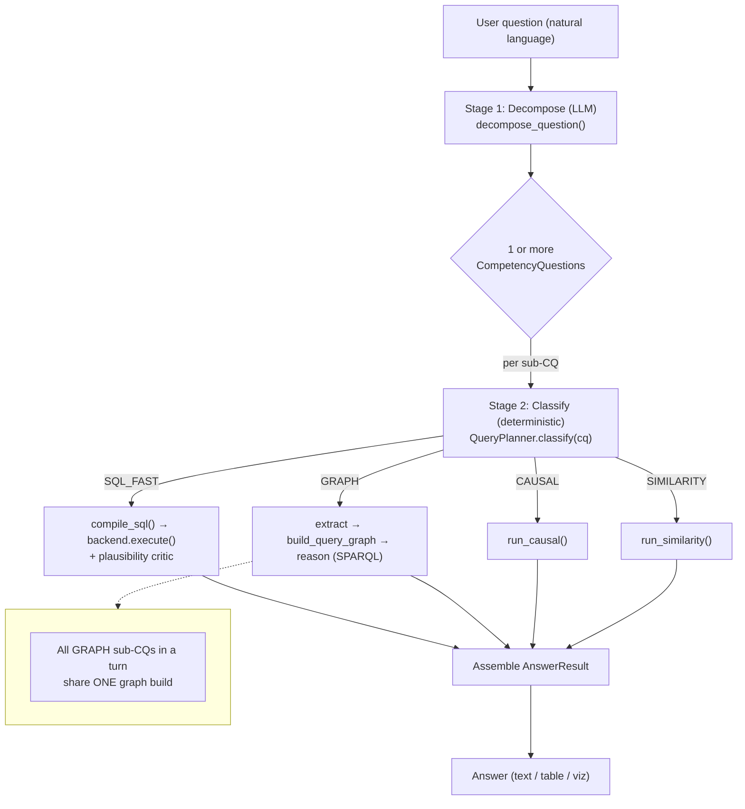
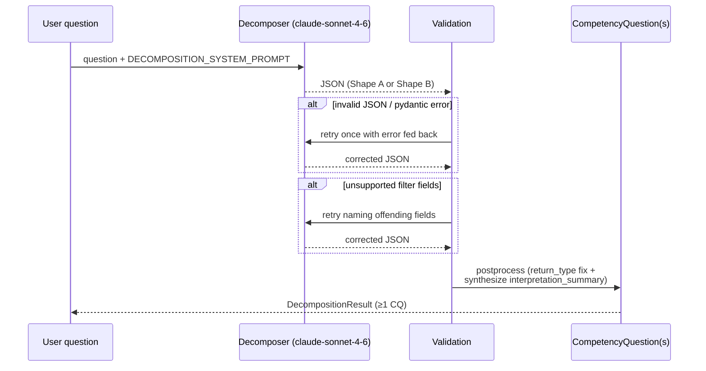
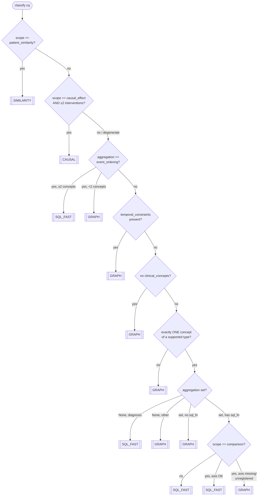

# Query Triage System

> How a natural-language clinical question is routed to one of the pipeline's
> execution paths — the SQL fast-path, the RDF graph-construction path, or a
> special-purpose path (causal / similarity).
>
> **Scope:** this document covers the *triage decision itself*, end to end. The
> internals of each execution path (how SQL is compiled, how the RDF graph is
> built, how SPARQL reasoning runs) are summarized only enough to explain *why* a
> route is chosen. For execution detail see `docs/architecture.md`; for the CQ
> schema history see `docs/decomposer-refactor-changelog.md`.

---

## 1. Overview

Every turn, a user question is translated into one or more **CompetencyQuestions**
(CQs) and each CQ is independently classified into exactly one **`QueryPlan`**:

| Plan | Meaning | Cost | When |
|------|---------|------|------|
| `SQL_FAST` | One direct SQL query against MIMIC. Skips extract → graph → SPARQL. | **Low** | Single-concept aggregates, diagnosis lists, simple comparisons, event-ordering. |
| `GRAPH` | Build the RDF knowledge graph (with Allen temporal relations) and answer with SPARQL. | **High** | Temporal relations, multi-concept reasoning, median/time-series, anything not SQL-compilable. |
| `CAUSAL` | Causal-inference path (`src/causal`). | High | `scope="causal_effect"` with ≥2 interventions. |
| `SIMILARITY` | Patient-similarity ranking (`src/similarity`). | Medium | `scope="patient_similarity"` with a similarity spec. |

`SQL_FAST` and `GRAPH` are the two main routes; `CAUSAL` and `SIMILARITY` are
narrow special cases that take priority when their scope is set.

**The problem this document investigates:** some questions that *should* take the
cheap `SQL_FAST` path are instead sent to `GRAPH`. Section 6 diagnoses why. The
short version: triage is a **two-stage** process (an LLM decomposer followed by a
deterministic planner), and the planner treats **any** temporal phrasing as an
absolute veto toward the graph — while the decomposer is actively encouraged to
attach temporal phrasing.

---

## 2. End-to-End Triage Flow



Key behaviors (`src/conversational/orchestrator.py:466-545`):

- The decomposer may return **one** CQ (Shape A) or **several** (Shape B,
  "big-question" decomposition). Each sub-CQ is classified *independently*.
- A single turn can mix routes: some sub-CQs go SQL, others go graph.
- All `GRAPH` sub-CQs in a turn share **one** graph build (`orchestrator.py:519-533`),
  and Allen-relation computation is skipped unless at least one of them has
  temporal constraints (`skip_allen_relations=not any_temporal`).
- If any sub-CQ carries a `clarifying_question`, the whole turn short-circuits and
  asks the user instead (`orchestrator.py:395-427`).

---

## 3. Stage 1 — The Decomposer (LLM)

**File:** `src/conversational/decomposer.py` · **Model:** `claude-sonnet-4-6` ·
**Prompt:** `src/conversational/prompts.py`

The decomposer is the *only* LLM step that influences routing. It does not choose a
route — but it populates the `CompetencyQuestion` fields that the planner reads, so
in practice it makes most of the routing decision implicitly.



### 3.1 The routing-relevant CQ fields

From `src/conversational/models.py` (`CompetencyQuestion`, lines 249-329). These are
the inputs the planner consumes:

| Field | Type | Routing effect |
|-------|------|----------------|
| `scope` | `single_patient \| cohort \| comparison \| causal_effect \| patient_similarity` | `causal_effect`/`patient_similarity` can short-circuit to CAUSAL/SIMILARITY. |
| `clinical_concepts` | list of `ClinicalConcept` | **count and type** gate the SQL fast-path (exactly one, of a supported type). |
| `aggregation` | `mean/avg/max/min/count/median/sum/exists/event_ordering/None` | Must have a `sql_fn` to be SQL-eligible (see §5). |
| `temporal_constraints` | list of `TemporalConstraint` | **Any non-empty value → GRAPH.** (Primary misrouting lever — §6.) |
| `comparison_field` | str / None | Comparison scope needs a registered axis with `sql_group_by`. |
| `split_condition` | `PatientFilter` / None | Enables the dynamic `condition` comparison axis on SQL. |
| `intervention_set` | list / None | ≥2 → CAUSAL. |
| `similarity_spec` | spec / None | Drives SIMILARITY (or cohort-narrowing on CAUSAL). |

### 3.2 How the prompt shapes these fields

The system prompt (`prompts.py`) is assembled from sections. The ones that most
affect routing:

- **`_DECOMPOSITION_GOALS`** explicitly tells the model to *"include temporal
  anchors (reference_event + time_window) whenever the question implies them
  ('first 24 hours', 'during ICU stay')."* This directly increases how often
  `temporal_constraints` is populated — and therefore how often the planner vetoes
  the SQL path (§6).
- **`_CONCEPT_TYPES`** carves out exceptions: *event-ordering* questions must set
  `aggregation:"event_ordering"` with ≥2 concepts and **no** temporal constraints
  ("the ordering IS the answer"); *value-threshold cohorts* (e.g. "platelets < 50k")
  must become `patient_filters`, not concepts.
- **`_SCOPE_INFERENCE`** + **`_BIG_QUESTION`** govern when `scope="comparison"` is
  used vs. a two-cohort Shape-B split, and when special scopes (causal / similarity)
  are chosen.

The supported-operations section is *generated from the registry* (`_operations_section`),
so the LLM's vocabulary of filters/aggregates/axes cannot drift from what the
compiler accepts.

---

## 4. Stage 2 — The Planner (deterministic)

**File:** `src/conversational/planner.py` · **Entry point:** `QueryPlanner.classify(cq)`
(lines 84-169). Pure function, no side effects, called once per sub-CQ.

`classify()` is an **ordered cascade** — the first matching rule wins. Order matters:
the special-scope and `event_ordering` rules deliberately run *before* the generic
single-concept guards that would otherwise send them to the graph.



### 4.1 The rule table

Every branch of `classify()`, in evaluation order, with the misrouting risk it
carries:

| # | Condition | Outcome | Source | Misrouting risk |
|---|-----------|---------|--------|-----------------|
| 1 | `scope == "patient_similarity"` | `SIMILARITY` | `:95-96` | — |
| 2 | `scope == "causal_effect"` and `len(intervention_set) ≥ 2` | `CAUSAL` | `:102-105` | Degenerate (<2) falls through. |
| 3 | `aggregation == "event_ordering"` and ≥2 concepts | `SQL_FAST` | `:114-116` | <2 concepts → GRAPH. |
| 4 | **`temporal_constraints` non-empty** | **`GRAPH`** | **`:120-121`** | **Primary — vetoes SQL even for trivial aggregates (§6).** |
| 5 | no `clinical_concepts` | `GRAPH` | `:127-128` | Metadata-only CQs the compiler could handle ("widen in a follow-up"). |
| 6 | `len(clinical_concepts) != 1` | `GRAPH` | `:131-132` | Multi-concept questions that are still simple aggregates. |
| 7 | concept type ∉ {biomarker, vital, drug, diagnosis, microbiology, outcome} | `GRAPH` | `:133-134` | e.g. `procedure` (only reachable via event_ordering). |
| 8 | `aggregation is None` and concept is `diagnosis` | `SQL_FAST` | `:138-142` | — (bare "list patients with X"). |
| 9 | `aggregation is None` and concept is non-diagnosis | `GRAPH` | `:144-146` | Raw-value lookups kept on graph "for now". |
| 10 | aggregate has no `sql_fn` (median, sum, exists) | `GRAPH` | `:148-150` | median/sum/exists are graph-only today (§5). |
| 11 | comparison: no `comparison_field` | `GRAPH` | `:155-156` | — |
| 12 | comparison: `condition` axis with no `split_condition` | `GRAPH` | `:161-163` | Underspecified split. |
| 13 | comparison: axis unregistered or no `sql_group_by` | `GRAPH` | `:165-167` | Axis not yet SQL-compilable. |
| 14 | otherwise | `SQL_FAST` | `:169` | — |

### 4.2 The four outcomes downstream (brief)

- **`SQL_FAST`** → `compile_sql()` → `backend.execute()`, then a plausibility critic
  with optional self-healing retry (`orchestrator.py:468-478`).
- **`GRAPH`** → `extract` → `build_query_graph` (Allen relations only if any sub-CQ is
  temporal) → `reason` (SPARQL) (`orchestrator.py:507-545`).
- **`CAUSAL`** → `_run_causal(cq)` (`orchestrator.py:479-491`).
- **`SIMILARITY`** → `_run_similarity(cq, backend)` (`orchestrator.py:492-506`).

---

## 5. The Registry & the "Widening Contract"

SQL-eligibility is **data-driven**, not hard-coded in the planner. The
`OperationRegistry` (`src/conversational/operations.py`) is the single source of
truth, and two descriptor fields decide fast-path reach:

- **`AggregateOperation.sql_fn`** — the SQL function (`AVG`/`MAX`/`MIN`/`COUNT`). When
  set, the planner can route a single-concept non-temporal CQ using that aggregate
  to SQL. `None` keeps it on the graph.
- **`ComparisonOperation.sql_group_by`** — the fully-qualified GROUP BY column. When
  set, that comparison axis is SQL-compilable.

**The contract:** *register a new aggregate with `sql_fn` (or an axis with
`sql_group_by`), and fast-path coverage widens automatically* — no planner edits.
This is enforced by `tests/test_conversational/test_planner.py:212-257`.

### Current inventory

| Aggregate (`operations_aggregates.py`) | `sql_fn` | Fast-path? |
|----------------------------------------|----------|------------|
| `mean` / `avg` | `AVG` | ✅ |
| `max` | `MAX` | ✅ |
| `min` | `MIN` | ✅ |
| `count` | `COUNT` | ✅ |
| `median` | — | ❌ (Python post-processing) |
| `sum` | — | ❌ (no clinically-useful template yet) |
| `exists` | — | ❌ |
| `event_ordering` | — | ✅ via dedicated branch (rule 3), not `sql_fn` |

| Comparison axis (`operations_comparison.py`) | `sql_group_by` | Fast-path? |
|----------------------------------------------|----------------|------------|
| `gender` | `p.gender` | ✅ |
| `age` | `p.anchor_age` | ✅ |
| `readmitted_30d` / `readmitted_60d` | `rl.readmitted_*` | ✅ |
| `admission_type` | `a.admission_type` | ✅ |
| `discharge_location` | `a.discharge_location` | ✅ |
| `condition` (dynamic split) | — (built from `split_condition`) | ✅ via rule 12 |

Supported single-concept SQL types are fixed in
`planner.py:71-73` (`_SQL_FAST_CONCEPT_TYPES`): biomarker, vital, drug, diagnosis,
microbiology, outcome. (`procedure` is absent — only reachable through
event-ordering.)

---

## 6. Diagnosis — Why SQL-Eligible Queries Reach the Graph

Misrouting originates at the **seam between the two stages**. It comes in two
flavors.

### 6.1 Planner-induced: the temporal veto (primary cause)

Rule 4 (`planner.py:120-121`) sends **any** CQ with a non-empty
`temporal_constraints` to `GRAPH`, with no inspection of whether the constraint
actually needs graph reasoning:

```python
# Temporal constraints always require the graph.
if cq.temporal_constraints:
    return QueryPlan.GRAPH
```

The rationale in the module docstring is sound for *relational* time ("Allen
relations live in the graph; lifting them into SQL would require explicit interval
joins and lose the semantic intent"). But it does **not** distinguish:

- **Relational/Allen constraints** — "creatinine *before* intubation", "events
  *during* an ICU day relative to another event". These genuinely need the graph.
- **Filter-style time windows** — "*during the ICU stay*", "*in the first 24h*".
  These are really cohort/time-bound filters that a SQL `WHERE` on `charttime`
  between admission/ICU bounds could express.

Both currently collapse into the same `temporal_constraints` list and both veto SQL.

This is reinforced from *both* sides:

1. **The decomposer is told to create these constraints.** `_DECOMPOSITION_GOALS`
   instructs the LLM to add temporal anchors "whenever the question implies them
   ('first 24 hours', 'during ICU stay')."
2. **The behavior is enshrined in tests.** `test_planner.py:160-165`
   (`temporal_during_constraint`) asserts that *"average creatinine during ICU
   stay"* (mean, cohort, single biomarker) **must** route to `GRAPH`.

**Worked trace:**

> *"What's the average creatinine during the ICU stay for patients over 65?"*

```
Decomposer → CompetencyQuestion(
    clinical_concepts=[creatinine: biomarker],
    aggregation="mean",
    patient_filters=[age > 65],
    temporal_constraints=[during "ICU stay"],   # <-- added per prompt guidance
    scope="cohort",
)
classify():
    rule 1-3  → no
    rule 4    → temporal_constraints non-empty → GRAPH   ← stops here
```

Without the temporal anchor this is a textbook `SQL_FAST` aggregate (it matches the
fast-path test `mean_biomarker_with_age_filter`, `test_planner.py:82-87`). The
single benign phrase "during the ICU stay" is the whole difference.

### 6.2 Decomposer-induced: spurious or coarse field population

Even when the planner rule is "correct," the LLM can populate fields in ways that
trip later rules:

- **Extra concepts** — splitting one question into two `clinical_concepts` trips
  rule 6 (`!= 1` → GRAPH) when one concept (or a single SQL query) would do.
- **`aggregation: null`** on a raw-value lookup trips rule 9 → GRAPH.
- **Over-eager `median`** where `mean` was meant trips rule 10 (`median` has no
  `sql_fn`) → GRAPH.
- **Unrecognized/typo'd `comparison_field`** trips rule 13 → GRAPH.
- **Temporal anchors invented** where the user implied none (false positives of the
  §6.1 mechanism).

### 6.3 Planner-induced: conservative "not yet widened" fall-throughs

Rules 5 and 9 send metadata-only and raw-value CQs to the graph *by choice*, even
though the compiler has (or could have) branches for them — the comments say "keep
on graph-path for now and widen in a follow-up." These are deliberate deferrals, not
bugs, but they are part of why the SQL path is narrower than it could be.

---

## 7. How to Observe & Change Routing

Practical hooks for developers working on the fix:

- **Add a decision log.** `classify()` is the one choke point. A single structured
  log line at each `return` (or one at the call site in `orchestrator.py:467`
  recording `cq.model_dump()` + chosen plan) gives per-question routing traces with
  no behavioral change.
- **Inspect a single question's classification** without running the full pipeline:
  decompose to a CQ, then call `QueryPlanner().classify(cq)` directly. The decomposer
  fixtures under `tests/test_conversational/` provide ready-made CQs.
- **The routing regression suite** is `tests/test_conversational/test_planner.py`.
  It is *behavioral*: fast-path cases (`:81-146`), graph-path cases (`:154-204`), and
  the registry-driven widening tests (`:212-257`). Any change to routing must update
  these tables — note that fixing §6.1 means **changing** the
  `temporal_during_constraint` expectation, which currently asserts GRAPH.
- **The prompt↔registry round-trip test** constrains decomposer-side changes: the
  supported-operations prompt section is generated from the registry, so adding a
  `sql_fn`/`sql_group_by` automatically updates both the prompt and fast-path
  coverage.
- **Parity guard.** SQL-path and graph-path results are expected to match within
  tolerance (`tests/test_conversational/test_sql_fastpath.py`). Any rule that moves a
  case from GRAPH to SQL_FAST must keep this parity.

---

## 8. Design Path (Proposed Directions)

These are options to weigh, not a committed implementation. They are ordered as a
suggested sequence; each later step is safer once the earlier ones land.

### D0 — Make routing observable & measurable *first*

Before touching any threshold, add the decision logging from §7 and assemble a
**labeled routing corpus**: a set of real questions tagged with their *desired*
plan. This converts "some queries are misrouted" into a measurable rate and gives
every later change a regression target. Low risk, high leverage.

### A — Split the temporal veto by *kind* of constraint (primary fix)

Teach the planner (and the `TemporalConstraint` model) to distinguish:

- **Relational/Allen** constraints (`before`/`after` another *event*) → keep on
  `GRAPH`.
- **Window/anchor** constraints ("during ICU stay", "first 24h" relative to
  admission/ICU bounds) → eligible for `SQL_FAST`, compiled as a `charttime`
  `WHERE` bound.

Concretely: rule 4 stops being an unconditional veto and instead inspects the
constraint's relation/reference. `TemporalConstraint` already carries `relation`,
`reference_event`, and `time_window` (`models.py:61-64`) — enough to classify "event
reference" vs "stay/admission window" without a schema change, though an explicit
`kind` discriminator would be cleaner.

**Trade-off / risk:** requires a matching compiler branch in `sql_fastpath.py` for
time-bounded aggregates, and the result-parity guard (§7) must hold against the
graph path. This is the change that most directly fixes the motivating bug, but it is
also the one that touches SQL generation.

### B — Tighten the decomposer so window-style time becomes a *filter*

Complementary to A and possibly cheaper as a first move: adjust the prompt
(`_DECOMPOSITION_GOALS` / `_CONCEPT_TYPES`) and example fixtures so that pure
time-window anchors are emitted as `patient_filters` (cohort/time-bound), reserving
`temporal_constraints` for genuine event-relative ordering. If the existing filter
surface can express the window, this fixes §6.1 *without* changing the planner — but
it leans on LLM compliance, so it pairs best with A as a backstop.

**Trade-off / risk:** depends on having (or adding) a time-window filter operation;
LLM adherence is probabilistic, so B alone won't be airtight.

### C — Widen the fast-path via the registry (incremental)

Use the widening contract to pull currently graph-only cases onto SQL where it's
clinically meaningful and a compiler branch exists or is cheap:

- `median` via an approximate/percentile SQL primitive (or accept exact-in-SQL where
  the backend supports it).
- Metadata-only CQs (rule 5) — LOS, mortality counts, admission details — already
  have fast-path compiler branches per the planner comments; flip them on.
- Raw-value lookups (rule 9) once the answerer/UI can consume SQL-shaped timestamped
  rows.

Each is independent, registry-scoped, and guarded by the existing parity + planner
tests.

**Trade-off / risk:** each item needs a compiler branch and careful parity checks;
do these one at a time, measured against the D0 corpus.

### Recommended sequencing

```
D0 (observe + corpus)  →  A (+ B as backstop)  →  C (incremental widening)
```

D0 makes the problem measurable; A (with B) fixes the dominant temporal-veto cause;
C then chips away at the deliberate "not yet widened" deferrals. The constant
constraint across all of them is **SQL/graph result parity** — every case moved onto
SQL must produce the same answer the graph would have.

---

## Appendix — File / Function Index

| Concern | Location |
|---------|----------|
| Route classification | `src/conversational/planner.py` — `QueryPlanner.classify()`, `QueryPlan` |
| Supported SQL concept types | `src/conversational/planner.py:71-73` |
| Decomposition (LLM) | `src/conversational/decomposer.py` — `decompose_question()` |
| Decomposition prompt | `src/conversational/prompts.py` — `build_system_prompt()` |
| CQ schema | `src/conversational/models.py` — `CompetencyQuestion` (249-329) |
| Operation registry | `src/conversational/operations.py` — `OperationRegistry`, `sql_fn`, `sql_group_by` |
| Aggregate inventory | `src/conversational/operations_aggregates.py` |
| Comparison-axis inventory | `src/conversational/operations_comparison.py` |
| Route execution | `src/conversational/orchestrator.py:466-545` |
| Routing tests (intended behavior) | `tests/test_conversational/test_planner.py` |
| SQL/graph parity tests | `tests/test_conversational/test_sql_fastpath.py` |
